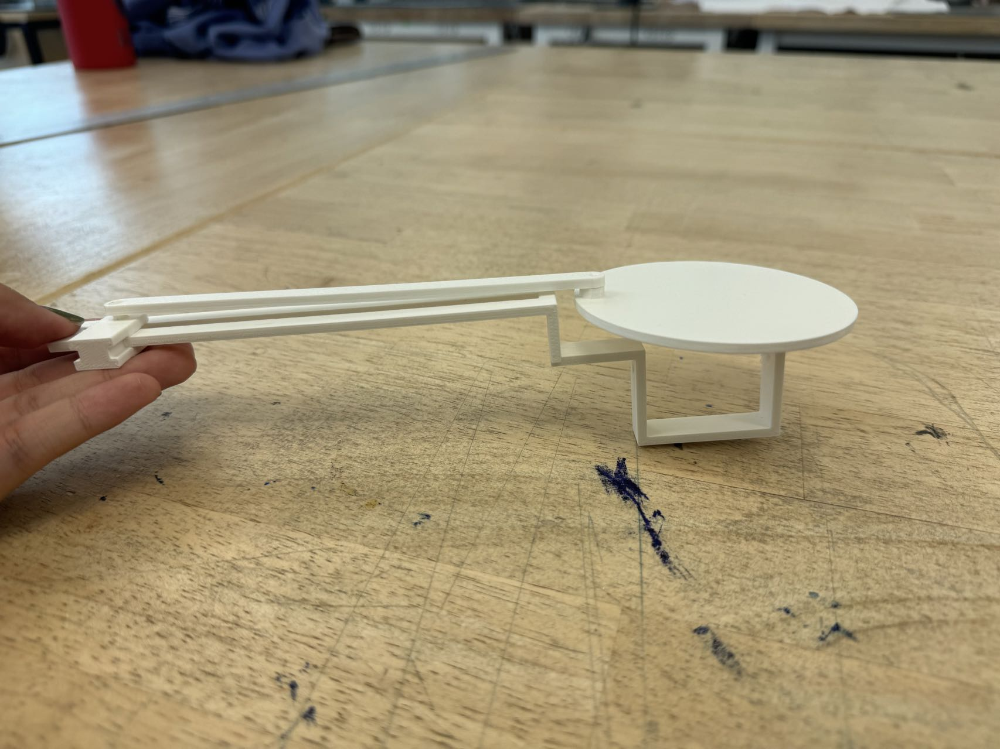

# Hello!
This is Tian Qin. Welcome to my TDF repository :)

# Menu
[week 10](#week-10-Mini-Me) \
[week 9](#week-9-Exploring-LLM) \
[week 8](#week-8-Project2) \
[week 7](#week-7-Project2-Experiments) \
[week 6](#week-6-Photon2-Stemma) \
[week 5](#week-5-Photon2) \
[week 4](#week-4-my-interaction-ecosystems) \
[week 3](#week-3-building-lampshade-with-grasshopper) \
[week 2](#week-2-experiment-with-rhino-and-grasshopper) \
[week 1](#week-1-laser-cutting)

---
# Week 10 Mini Me

# Week 9 Exploring LLM

# Week 8 Project2 

  

## Project Title: Echoes of the Earth  
**Team Name**: Fuller Team  
**Team Members**: Tian Qin, Chuhua Ding  
**Link to Presentation Video**: [https://youtu.be/nMcBBjLFRlk](https://youtu.be/nMcBBjLFRlk)  

## Diagrammatic Analysis

### Ecosystem Architecture

  

The ecosystem architecture diagram provides an overview of the interconnected components and data flow within our interactive installation:

- At the center of the system, Particle Cloud Services acts as a mediator, enabling communication between physical components and external users. It receives requests from Socket.io, which manages user interactions on the web interface. The web-based connection allows users to influence the installation remotely, with user data transmitted to the Particle Cloud as an output, and response data fed back to Socket.io as an input.
- Two Particle Photon 2 microcontrollers manage the core sensory and response functions of the installation. The first Photon processes analog inputs from the Gesture Sensor (Stemma QT) and Temperature Sensor (Stemma QT), which track user gestures and ambient temperature, respectively. This Photon then sends data to the Particle Cloud, facilitating real-time interaction.
- The second Particle Photon 2 receives data from the Particle Cloud via Wi-Fi, interpreting inputs to control physical outputs. It drives the Servos, producing analog outputs that create motion, and adjusts the Neopixel color and brightness. These elements work in concert to simulate the shifting, wave-like behavior of a natural ecosystem.

### Ecosystem Process

  

This process diagram provides a clear, step-by-step view of the interactions and data flow within our installation’s ecosystem.

- The left side of the diagram starts with User Interactions, such as gesture inputs and web page interactions. These interactions are picked up by Sensors—the Temperature Sensor and Gesture Sensor—which continually monitor environmental conditions and user gestures. This initial stage reflects how data from the physical environment is captured and relayed for processing.
- The diagram then shows how data moves into the Microcontroller stage. The Photon 2_1 microcontroller reads sensor data and sends it via Wi-Fi to the Particle Cloud Service. The Particle Cloud then transmits this data to Socket.io, connecting with the external web interface, allowing user interactions from the web page to influence the installation. Additionally, the Photon 2_2 microcontroller handles actuator responses, sending signals to the Neopixels and Servos based on received data. These responses manifest physically, with changes in light and the dome structure’s movement, providing feedback to the users.

## Prototype Demonstration

  
  

  
  

*Echoes of the Earth* is an interactive installation that captures the dynamic and fluid nature of ecosystems. Its rubber surface, animated by servos, undulates in response to hand gestures, evoking the movement of sand dunes or ripples on water when touched by wind or living creatures. As the room temperature shifts, the installation’s light adjusts, representing how temperature changes can impact natural habitats. Through its web integration, Echoes of the Earth extends beyond physical space, allowing remote audiences to influence the installation’s movements, underscoring the global impact of local actions. This piece serves as a reminder of the intricate connections that shape our environment, inviting contemplation of our role in sustaining or disturbing the delicate balance of nature.

---

### Development Process

1. **Individual Component Testing: Neopixels and Servos**: We began by testing individual components to ensure they worked as intended. This included lighting up neopixels and controlling the rotation of servos to verify that each part was responsive and adjustable.
2. **Sensor Data Logging and Calibration**: Next, we experimented with the Temperature Sensor and Gesture Sensor, logging data to calibrate them. This step allowed us to understand sensor sensitivity and ensure they could accurately capture environmental changes and user gestures.
3. **Potentiometer-Controlled Brightness and Servo Movement**: To further refine control, we conducted experiments using a potentiometer to adjust the brightness of the neopixels and the rotation of the servos. This provided insights into analog input adjustments, helping us balance the interaction flow.
4. **Cloud Integration and Data Synchronization via Particle Photons**: We connected two Particle Photons to the Particle Cloud, experimenting with sending sensor data from one Photon to another. This integration enabled real-time data synchronization, laying the foundation for remote user interaction.
5. **Socket.io Webpage Connection**: Using Socket.io and a Node.js server hosted on Glitch, we tested interactions between the web page and the Particle Cloud. Each time a new user accessed the page, the server logged their connection, creating a glowing dot to represent the user’s presence.
6. **Full System Integration and Stress Testing with Four Servos and Two Neopixels**: After ensuring each component functioned independently, we combined all elements, including four servos and two neopixels, for full system integration. This step involved stress-testing to ensure stable operation without signal interference or power issues.
7. **Physical Fabrication Prototyping with Grasshopper**: Before constructing the physical structure, we used Grasshopper to experiment with different patterns and structural layouts. This ensured that movable parts would not interfere with each other and provided a visualization of the dome’s potential movement.

---
## Speculations

### Human Experiences
Our project illustrates how systems thinking could reshape cultural expectations in the Anthropogenic Environment, encouraging individuals to see their actions as part of a larger network. Just as gestures influence the installation’s movement and lighting, people might become more aware of their impact on the environment, leading to more mindful, ecologically conscious behaviors. This project experience suggests a shift toward valuing sustainable technologies that respond to human actions within environmental limits.

### Engineering
Our project’s interconnected components showcase how engineering in Digital Ecosystems goes beyond isolated products, creating responsive, adaptive systems. By syncing sensors, cloud services, and actuators, we designed an installation that dynamically responds to users. This approach could shift engineering expectations, with future systems designed to adapt in real time to users and environments. Engineers might increasingly be seen as creators of flexible, sustainable systems rather than static products.

### Role of AI in the Design Process
AI could enhance projects like ours by predicting user behavior and adapting responses for a seamless experience. In broader Digital Ecosystems, AI might continuously analyze data to maintain balance, such as optimizing resource use in response to environmental changes, as with our temperature-sensitive LEDs. This could lead to AI-driven ecosystems that balance human needs and ecological health, mediating interactions for sustainable, adaptive environments.

# Week 7 Project2 Experiments
This week, we conducted a variety of experiments for Project 2 following our group meeting with TJ. These experiments not only advanced our technical understanding but also paved the way for future creative applications.

**Diagrams Update** \
First, we updated our proposal, system architecture, and process diagram based on TJ's feedback and suggestions. We added one more Photon to explore how to facilitate communication between two Photons.  This addition not only strengthens our project’s communication framework but also introduces a new layer of complexity that will allow us to investigate multi-node interactions.

  
  

**Dynamixel Servo** \
As suggested by TJ, we acquired three Dynamixel XL320 servos from Sudhu, which are significantly more powerful than standard servos and can provide torque and status data. However, we encountered challenges finding a compatible library for Particle. Despite trying various methods, we were unsuccessful and ultimately decided to revert to standard servos for our ongoing experiments.

  

**Linear Actuator** \
Initially, we considered purchasing linear actuators from Amazon, but found them to be prohibitively expensive. Instead, we opted to create our own using standard servos and 3D printing. Chuhua designed the 3D model, which we printed with promising results.

  
  

The actuator's performance exceeded our expectations, inspiring us to experiment with varying the disk's shape in the coming days. This DIY approach not only reduced costs but also provided valuable hands-on experience in mechanical design and prototyping.

**Neopixel** \
We faced significant difficulties with the Neopixel, even in lighting it up. Initially, the Neopixel library was incompatible with Particle, resulting in compilation errors despite correctly importing the library. After consulting ChatGPT, I wrote code to light up the Neopixel without a library, which confirmed that the Neopixel was functional.

Thanks to TJ and Sudhu, we finally managed to use the Neopixel library to control the Neopixel.

  
  

I further modified the code to create fading effects and controlled the lights with a potentiometer.

  
  

Additionally, we made the potentiometer control the servo.

  

**Physical Structure** \
We purchased rubber material to laser cut an auxetic structure. Our initial plan was to create an arched face, but after some experimentation, we realized it was challenging to achieve a well-formed arch. Consequently, we adjusted our design to create a flat surface instead. This is a very interesting part for me, since I get to know these architecture related concepts for the first time. This kind of structure is very challenging but I feel excited to learn about it. 

  

**Sensors** \
We tested our gesture and temperature sensors, building on our previous experiences, which made this phase of the experiment relatively smooth. Chuhua also designed the container for the sensors in our installation.

  
  

**Future Directions** \
Looking ahead, we foresee several avenues for development. The integration of more advanced communication protocols between the Photons could lead to more sophisticated interactions and data sharing capabilities. Additionally, experimenting with different shapes and mechanisms for our linear actuator may yield innovative movement patterns that enhance the overall project design.

Moreover, our recent success with the Neopixel demonstrates the potential for integrating visual elements more effectively into our installations, offering an engaging experience for users. This opens the door to exploring more complex lighting sequences and color patterns that can react to user input or environmental changes.

# Week 6 Photon2 Stemma

  
  

**Soldering** \
This is not the first time for me to solder, so it didn't take long to accomplish this. I was originally worried about sticking two pins together when soldering, but it actually went smoothly. 

**Stemma Modules** \
The APDS9960 is a digital RGB, ambient light, proximity and gesture sensor. The proximity data ranges from 0 to 255, where 0 represents the farthest object from the sensor and 255 represents the closest object. If there is no object within the range, it just return 0. I think the proximity data from the sensor is quite accurate, but I'm not sure about the RGB data. I tried putting objects with different colors above the sensor, but the RGB value didn't change accordingly. For example, as is shown in the image below, when I put a red object above the sensor, the "red" data didn't really become bigger.

  
  

The Acceleration sensor works better and is very sensitve. By rotating the sensor, I can see how different data is changing accordingly. I also added a delay in the loop function to slower the data logged in the serial monitor. 

  
  

One of the major achievements this week was the completion of the Project 2 proposal. We created both a Draft System Architecture and a Process Diagram, which significantly helped us clarify the various components and interactions involved in the project. These diagrams allowed us to visualize the workflow from sensors to actuators, cloud services, and user interactions.

  
  

The architecture involves key components like a Particle Photon 2, connected sensors (such as Temperature and Gesture Sensors), and actuators (LED Lights, Linear Actuator, and Motor Drive).
Data from the sensors is processed by the Photon 2 and then sent to the cloud via Particle Cloud Services, which is connected to an external API, Socket.io. This ensures continuous communication between the hardware and the web interface, enabling real-time responses to user inputs.

Having these diagrams in place early in the project has been instrumental for better planning and anticipating potential bottlenecks. They provided a clear framework for how data moves through the system and how users interact with it, ensuring the project is on track with technical feasibility and user experience.

These diagrams not only helped in the current project’s planning but could also serve as templates for future projects involving IoT and interactive systems. The architecture shows a scalable framework that could easily be adapted to other types of sensors and actuators. For instance, replacing gesture sensors with other interaction modes (such as sound or pressure sensors) would require minimal changes to the core architecture, making it highly adaptable for diverse applications.

Additionally, the integration of Socket.io with Particle Cloud Services suggests potential use in future multi-user interactive installations. We could extend this to projects where real-time user collaboration or interaction across different locations is essential, enabling a more robust, distributed network of users interacting with physical objects or virtual systems.

# Week 5 Photon2

First of all, I think one of the most effective ways to address errors appeared during flashing, is unplug the board and plug it in again, if all the other settings are ok. I struggled with errors popped up during flashing several times, and simply replug the board solve most issues. 

I started with modifying the example code we did last thursday. I played around the code and made a simple timer. 

  
  

Then I started to put the circuit together. The first question I encountered was how to recognize the value of the resistors we got in the kit. I could only find one resistor that looks the same with the one on the circuit diagram. Baurzhan told me that I can calculate the value with [this website](https://www.digikey.com/en/resources/conversion-calculators/conversion-calculator-resistor-color-code). Also in many cases, the value doesn't need to be exactly the same to the diagram. 

  

After completing the first four steps, I encountered another problem. The LED didn't blink. I noticed that the positive and negative poles of the LED are reversed in the circuit diagram. After changing the connection, the LED successfully blinked with the periodicity.

  
  

Then I started to experiment on the other tutorials. I first tried the servo. It was surprisingly easy to connect the circuit. However, I don't have the accelerometer in my kit, so I modified the code to just rotate around the servo. This actually gave me a chance to look deeper into the code, instead of simply copy and paste. I really like the servo colored the three wires so it's easier for users to connect the circuit. 

  

Next, I tried the button send-on-change example. This is not a complicated example, but I see a lot of potentials from it. For example, I can make physical installations that enable people from different continents to interact with each other through sending interaction data to the cloud. That will give people a sense of connection more than just texting or doing facetime.

  

Finally, it's the fsr (force sensitive resistor) -> RGB-led color fader. After pasting the example code, I noticed that there are some errors when compiling the code. 

  

It shows that setTarget and setColor are not declared in the scope, and I think it's an issue related with the function prototype Jeff mentioned during Monday's class. Therefore I modified the code and added function prototypes for those two functions, and it resolved the errors successfully. Now I get to understand that although in the example we did during class, it still works without the function prototypes, there are still cases where function prototype is necessary. So it's just always nice to have it.

After solving the code problem, it works! However, I think the fsr sensor is not very stable. Sometimes it's triggered when I'm not touching it while sometimes it doesn't respond even if I'm touching it really hard. I'm not sure if it's the issue with the unstable connection.

  

Regarding the question what kinds of ecosystems are missing in your daily life, I think the Financial & Banking Ecosystems is missing. As I don't have any background in finance, the financial and banking system always looks complicated for me. It would be great if some AI assistants can help to explain and guide users with no knowledge in finance to learn about the wealth management process. 

# Week 4 My Interaction Ecosystems

  

I created a network map of my entertainment & media ecosystem, which visualize the devices, applications, and platforms I used in my daily life for entertaining purposes.  

I started my map with listing out all the devices or objects I used daily for entertainment. The ones that I used most often are definitely mobile phone, laptop, and ipad. These are my primary devices that serve multiple purposes beyond just entertainment. The overlapping of applications between these devices (e.g., Netflix, WeChat) offer cross-device functionality, allowing for seamless transitions between devices depending on the environment (e.g., using Instagram on mobile phone outside or watching YouTube on the iPad when relaxing at home).  

There are some other devices that have specialized roles in the entertainment ecosystem. Switch is primarily for gaming with games like Super Mario Odyssey and Animal Crossing, while Oculus supports VR experiences like Beat Saber. These two devices are highly immersive, focusing specifically on gaming and virtual reality, respectively. 

Between devices and platforms, content flows smoothly. Photos captured on the camera may end up edited on Photoshop and then shared via Instagram. Similarly, media consumption across Netflix, YouTube, and podcasts happens seamlessly across my devices, showing a well-connected media ecosystem.  

I believe in the future, there will be more content flowing between difference devices and platforms. Or there will be less devices serving just for one single purpose, like gaming. Switch, PS5, and other gaming devices may be merged together with our laptop, computer, and finally to an XR device like Meta Orion.

  

This week, I also continued exploring 3D printing in Studio Foundation class. I tried the bambu lab 3D printer at the Citris Invention Lab, and the result turned out really delicate. We also learned how to use metal threaded inserts to assemble the 3D printed part and the ccrylic board. 

  
  

# Week 3 Building Lampshade with Grasshopper

After exploring Rhino and Grasshopper last week, I started trying to build my own model with grasshopper. I chose to create a lampshade cause the small ikea lamp on my desk is very dazzling, as the light bulb is directly facing the eyes. 

I firstly sketched out the shape of my lamp and the lampshade. 

  
  

Based on a grasshopper tutorial of a [parametric vase](https://www.youtube.com/watch?v=jGIqvAQRXEc), I also sketched out the rough process in grasshopper to make it easier. 

  

I learned many new components during the process. For example, the Revolution component is used to create a surface by rotating the curve around an axis, so I can create an annular surface as the basic shape of the lampshade. Weave takes two input lists and combines them into one single output list, so it combines the two sets of curves together to make a wavy pattern. Then I use loft to create a surface by connecting those curves. 

To make the shade perfectly fit my lamp, I imported a side photo of my lamp into rhino to check. I also measured the perimeter of each part of my lamp carefully to make sure the size of the model matches the lamp. 

  
  

  
  

I encountered many challenges during the process, for example trying to understand what each component is doing and a lot of debugs. However, it turns out the biggest challenge is printing this model out. It failed several times because the shape of the bottom is very wavy and tortuous. And finally, it succeeded on the third try! Although the printing temperature was set too high, makes it very difficult to take off the support. 

  
  

From this project, I noticed that I should learn about the constrains of the tools and medium that I’m using, and design the project based on that. For example with 3d printer, it would be much easier to print something with a flat bottom instead of a curly bottom.

  
  

# Week 2 Experiment with Rhino and Grasshopper  #

This week I started with going through a rhino 8 beginner [tutorial](https://www.youtube.com/watch?v=mAXknDTPULE&list=PLWIvZT_UEpWXs6niI0BiWz2xMg0bHbEfs&index=4) to get familiar with the interface and functions of rhino. The tutorial was only 1 hour, but it took me more than one afternoon to follow the tutorial to finally build a chair. I managed to understand some basic but seems to be important rhino concepts during the process, like c plane, planar curves, osnap, pushpull, mirror, inset, scale1D.

  
  

  
  

I also learned grosshopper with this [tutorial](https://www.youtube.com/watch?v=CzmZjo2_3-M) and successfully built a box with a lid. It was interesting to learn and really helpful for understanding the grasshopper graph we got in class. 

  

One very useful concept from grasshopper is brep. It appears a lot in the example file and I was so confused at first. Later I noticed that brep can be anything and in many cases it’s used for make the diagram clearer and more organized. 

Another useful trick that I learned from Chuhua is that by clicking this little green button in the upper right corner, I can easily preview what I selected in grasshopper. This really helps me to understand what each part of the grasshopper file is doing.

  

So with help of that, I drew out the diagram of the steps building the shape of the phone stand. 

  

And then I started to modify the example file to replace some nodes and change the shape of the phone stand.

  

---

# Week 1 Laser Cutting #

This week, I went through the laser cutting and 3d printing tutorials and quiz. I design and laser cut a coaster with the photo of my dog. It was an interesting experience to custom make something useful by myself. 

I used 3mm plywood to make the cut and the result was really satisfying. This was also a very helpful refresh for using those machines. 

  
  
  

  

---
## Quick Links: ##

- [TDF Wiki](https://github.com/Berkeley-MDes/24f-desinv-202/wiki) - the ultimate source for truth and information about the course and assignments
- [Google Drive Folder](https://drive.google.com/drive/u/0/folders/1DJ1b6sSDwHXX6NRcQYt10ivyQSgU0ND6) - slides and other resources
- [bCourses](https://bcourses.berkeley.edu/courses/1537533) - where the grading happens
